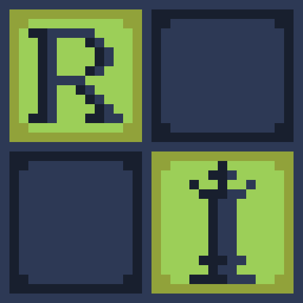

<p align="center">
  
  <br>
  <sup>Designed by <a href="http://swarupgt.thesimple.ink/">Swarup Totloor</a></sup>
</p>

# Ranga

**Ranga** is a fully functional, UCI-compatible chess engine written in **Go**.

> **Note**: Ranga is a chess engine, meaning it does not have its own graphical user interface (GUI). To play against it, you will need to load the executable into a UCI-compatible chess GUI (such as Arena, Cutechess, or en-croissant).

## Getting Started

### Prerequisites

- [Go](https://go.dev/dl/): `1.26.5` or above *(or Docker, if you'd rather skip a local install)*.
- [Task](https://taskfile.dev/installation/)

### Local Installation

1. Clone the repository.
2. Build the binary using the Makefile:

```bash
task build
```

### With Docker

Docker will build the binary and export the output executable directly the local `./bin` directory.

```bash
task build-docker
```

**Linux**
```bash
task build-docker-linux
```

**Mac (Silicon)**
```bash
task build-docker-mac
```

**Windows**
```bash
task build-docker-windows
```

## Usage

### Loading into GUI

Point your GUI's "Add Engine" or "Install Engine" dialog at the built binary (`./bin/ranga`, or `ranga.exe` on Windows). Ranga will identify itself over the UCI protocol and the GUI will handle the rest.

### Running from CLI

```bash
./bin/ranga
```

Interact with it directly using UCI commands, for example:

```bash
uci
id name ranga
id author nchandur
uciok
isready
readyok
position startpos moves e2e4 e7e5
go wtime 300000 btime 300000 winc 0 binc 0
info depth 1 score cp 0 nodes 29 nps 244812 time 0
info depth 2 score cp 0 nodes 114 nps 1405238 time 0
info depth 3 score cp 0 nodes 1222 nps 1864581 time 0
info depth 4 score cp 100 nodes 37338 nps 4873802 time 7
info depth 5 score cp 0 nodes 189148 nps 5706489 time 33
info depth 6 score cp 100 nodes 11813416 nps 15321989 time 771
info depth 7 score cp 0 nodes 43542132 nps 12190628 time 3571
info depth 8 score cp 0 nodes 46904025 nps 15054504 time 3115
bestmove a2a3
```

### Supported UCI commands
 
| Command                          | Description |
|----------------------------------|-------------|
| `uci`                            | Identifies the engine and confirms UCI protocol support |
| `isready`                        | Confirms the engine is ready to receive further commands |
| `ucinewgame`                     | Resets internal state for a new game |
| `position startpos [moves ...]`  | Sets up the standard starting position, optionally followed by a sequence of moves |
| `position fen <fen> [moves ...]` | Sets up a position from FEN string, optionally followed by a sequence of moves |
| `go [options]`                   | Starts a search — see supported `go` parameters below |
| `eval`                           | Prints the static evaluation of the current position |
| `show`                           | Prints an ASCII representation of the current board |
| `clear`                          | Clears the current board state |
| `stop`                           | Stops the search currently in progress and returns the best move found so far |
| `quit`                           | Exits the engine process |

### Supported `go` parameters
 
| Parameter               | Description                                      |
|--------------------------|--------------------------------------------------|
| `depth <n>`              | Search to a fixed depth                          |
| `movetime <ms>`          | Search for a fixed amount of time                |
| `wtime <ms>` / `btime <ms>` | Remaining clock time for white / black        |
| `winc <ms>` / `binc <ms>`   | Increment per move for white / black          |
| `movestogo <n>`          | Moves remaining until the next time control      |
| `infinite`               | Search until an explicit `stop` command          |

## Estimated Strength **~417-489**
> See [here](docs/results.md#elo-estimate) for the full breakdown
