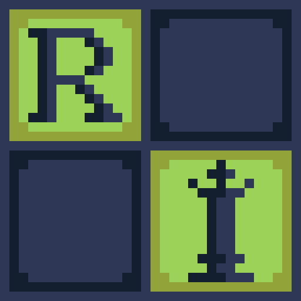

<p align="center">
  
  <br>
  <sup>Designed by <a href="http://swarupgt.thesimple.ink/">Swarup Totloor</a></sup>
</p>

# Ranga

**Ranga** is a UCI-compatible chess engine written in **Go**.

## Strength

Tested with SPRT against predecessor and with a progression test against Stash 21. Results are recorded in [results.md](docs/results.md).
> These results come from my own hardware, time controls and opponents. They are **not** CCRL ratings and should not be compared with rating lists.

## Building

### Prerequisites

- [Go](https://go.dev/dl/) `1.27.1` or above *(or Docker, if you would rather skip a local install)*
- [Task](https://taskfile.dev/installation/) (optional if you build with `go build` directly)

### Local build

```bash
task build
```

Without Task, build it directly with Go:

```bash
go build -o bin/ranga ./cmd
```

### Docker

Docker builds the binary inside a container and exports it to the local `./bin` directory.

```bash
task build-docker
```

To target a specific platform:

| Platform      | Command                       |
|---------------|-------------------------------|
| Linux         | `task build-docker-linux`     |
| Mac (Silicon) | `task build-docker-mac`       |
| Windows       | `task build-docker-windows`   |

## Usage

Ranga is a chess engine and has no graphical interface of its own, so to play against it you need a UCI-compatible GUI such as [Arena](http://www.playwitharena.de/), [Cute Chess](https://cutechess.com/) or [en-croissant](https://encroissant.org/).

### GUI

Point the GUI's "Add Engine" or "Install Engine" dialog at the built binary. The engine identifies itself over UCI, advertises its options and the GUI handles the rest.

### CLI

Run `./bin/ranga` and type UCI commands.

```bash
uci
id name ranga 1.16
id author nchandur
option name Threads type spin default 1 min 1 max 1
option name Hash type spin default 16 min 1 max 2048
option name Clear Hash type button
uciok
position startpos moves e2e4 e7e5
go depth 8
info depth 1 score cp 26 nodes 63 pv g1f3
info depth 2 score cp 27 nodes 322 pv g1f3 b8c6
info depth 3 score cp 30 nodes 2956 pv g1f3 b8c6 b1c3
info depth 4 score cp 21 nodes 6994 pv g1f3 b8c6 b1c3 g8f6
info depth 5 score cp 24 nodes 15756 pv g1f3 b8c6 b1c3 g8f6 f1e2
info depth 6 score cp 22 nodes 44356 pv g1f3 g8f6 f3e5 f6e4 b1c3 d7d5
info depth 7 score cp 21 nodes 88364 pv g1f3 g8f6 b1c3 b8c6 d2d4 e5d4 f3d4
info depth 8 score cp 17 nodes 291347 pv g1f3 b8c6 d2d4 e5d4 f3d4 c6d4 d1d4 g8f6
bestmove g1f3
```

### `bench`

Performs search on a fixed set of positions and reports total nodes searched and NPS. 

```bash
./path/to/bin bench
6246695 nodes 3147 time 1984968 nps
```

## UCI Reference

### Standard commands

| Command                          | Description |
|----------------------------------|-------------|
| `uci`                            | Identifies the engine, lists its options and confirms UCI support |
| `isready`                        | Replies `readyok` when engine is ready for further commands |
| `setoption name <id> value <x>`  | Sets engine option (see below) |
| `ucinewgame`                     | Resets board to the starting position |
| `position startpos [moves ...]`  | Sets up starting position |
| `position fen <fen> [moves ...]` | Sets up a position from FEN string |
| `go [options]`                   | Starts a search (see parameters below) |
| `stop`                           | Stops the current search and returns current best move |
| `quit`                           | Stops any search and exits the engine |

### Options

| Option | Type | Description |
|--------|------|-------------|
| `Hash` | spin | Transposition table size in MB (default 16) |
| `Clear Hash` | button | Clears transposition table |

### `go` parameters

| Parameter                   | Description                                 |
|-----------------------------|---------------------------------------------|
| `depth <n>`                 | Search to fixed depth                     |
| `nodes <n>`                 | Limit search to a number of nodes       |
| `movetime <ms>`             | Search for fixed amount of time           |
| `wtime <ms>` / `btime <ms>` | Remaining clock time for white / black      |
| `winc <ms>` / `binc <ms>`   | Increment per move for white / black        |
| `movestogo <n>`             | Moves remaining until next time control |
| `infinite`                  | Search until an explicit `stop` command     |

### Debug commands

These are not part of the UCI standard and are mainly useful when developing.

| Command         | Description |
|-----------------|-------------|
| `eval`          | Prints the static evaluation of the current position in pawns |
| `show`          | Prints an ASCII representation of the current board |
| `clear`         | Removes all pieces from the board |
| `go perft <n>`  | Runs perft to depth `n` and prints the node count for each root move |
