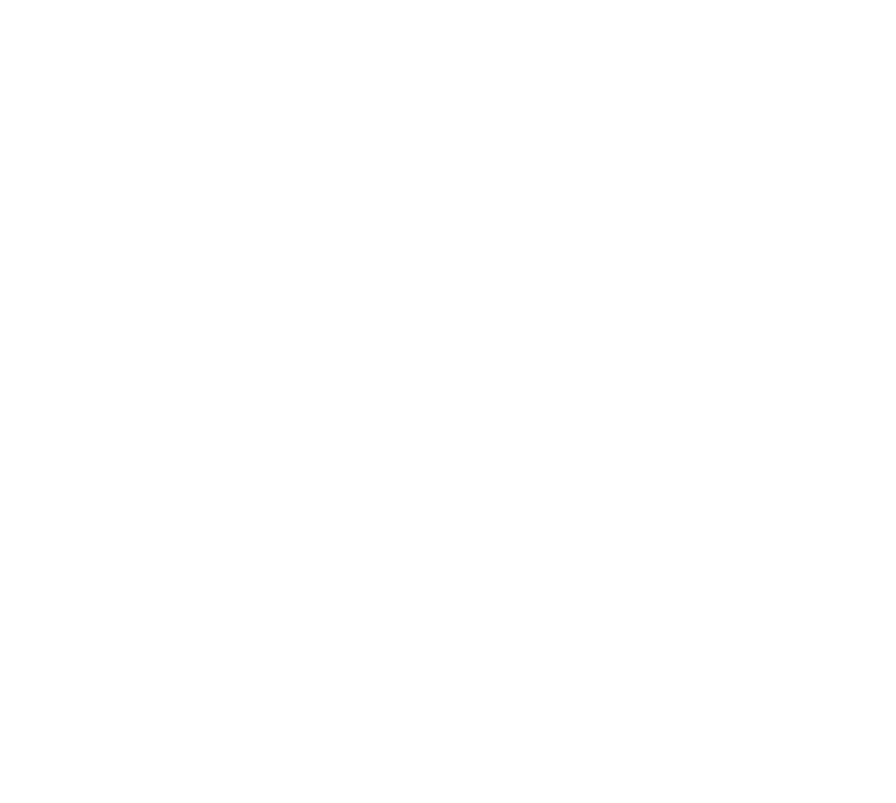

## Network Architecture

The engine evaluates positions with an NNUE: a small, fully connected network whose first layer is updated incrementally as moves are made and unmade. The architecture follows the `simple` example from the [bullet](https://github.com/jw1912/bullet) trainer, with a hidden layer size of 32.

**Architecture:** `(768 -> 32) x 2 -> 1`

| Property | Value |
|---|---|
| Inputs | 768 (2 colors x 6 piece types x 64 squares) |
| Hidden layer size | 32 (per perspective) |
| Hidden activation | SCReLU |
| Output size | 1 |
| Perspective | Dual (side-to-move / not-side-to-move) |
| Parameters | 24673 |
| Quantization | `QA = 255` (feature layer), `QB = 64` (output layer) |
| Eval scale | 400 |

### Diagram

### Layers

**Feature layer (768 -> 32):**

Each input is a binary flag for a specific piece of a specific color on a specific square. The same weights are used for both perspectives; the board is viewed from each side in turn, producing two 32-value accumulators.

**Activation (SCReLU):**

Each accumulator value is clamped to `[0, QA]` and then squared.

**Output layer (64 -> 1):** 

The two activated accumulators are concatenated, side-to-move first, and the result is a single dot product with the output weights plus a bias.

### Quantization

The feature layer is scaled by `QA` and the output layer by `QB`. After the output dot product, the raw sum is divided by `QA` to undo the extra scaling from squaring, the output bias is added, the result is multiplied by `Scale`, and finally divided by `QA * QB` to give the evaluation in centipawns.
